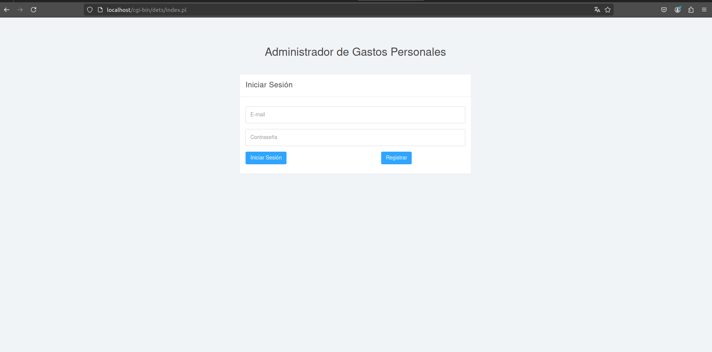
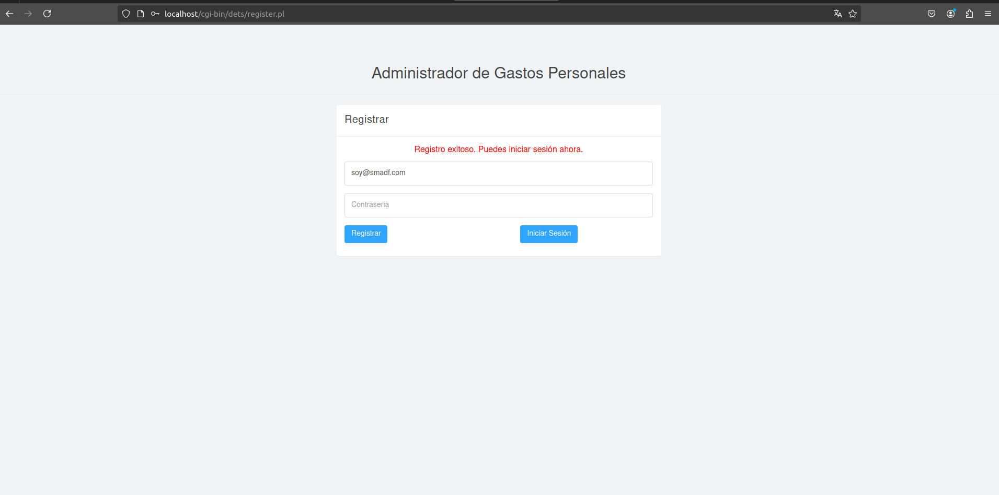
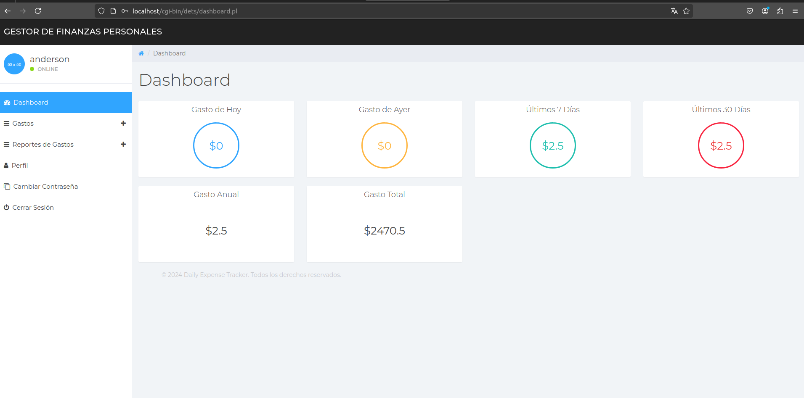
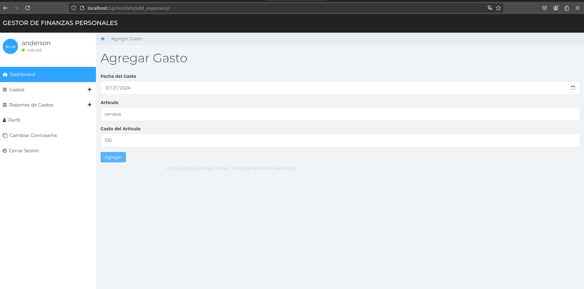
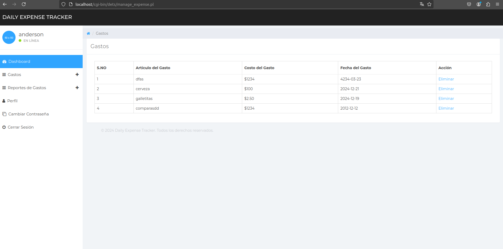

<div align="center">
<table>
    <theader>
        <tr>
            <td></td>
            <th>
                <span style="font-weight:bold;">UNIVERSIDAD NACIONAL DE SAN AGUSTIN</span><br />
                <span style="font-weight:bold;">FACULTAD DE INGENIERÍA DE PRODUCCIÓN Y SERVICIOS</span><br />
                <span style="font-weight:bold;">DEPARTAMENTO ACADÉMICO DE INGENIERÍA DE SISTEMAS E INFORMÁTICA</span><br />
                <span style="font-weight:bold;">ESCUELA PROFESIONAL DE INGENIERÍA DE SISTEMAS</span>
            </th>
            <td></td>
        </tr>
    </theader>
    <tbody>
        <tr><td colspan="3"><span style="font-weight:bold;">Formato</span>: Guía de Práctica de Laboratorio</td></tr>
        <tr><td><span style="font-weight:bold;">Aprobación</span>:  2022/03/01</td><td><span style="font-weight:bold;">Código</span>: GUIA-PRLD-001</td><td><span style="font-weight:bold;">Página</span>: 1</td></tr>
    </tbody>
</table>
<table>
    <thead>
        <tr>
            <th>Estudiante</th>
            <th>Escuela</th>
        </tr>
    </thead>
    <tbody>
        <tr>
            <td>Auccacusi Conde Brayan Carlos<br />bauccacusic@unsa.edu.pe</td>
            <td>Ingeniería de Sistemas</td>
        </tr>
        <tr>
            <td>Palma Apaza Santiago Enrique<br />spalmaa@unsa.edu.pe</td>
            <td>Ingeniería de Sistemas</td>
        </tr>
        <tr>
            <td>Pamo Condori Benjamin Andre<br />bpamoc@unsa.edu.pe</td>
            <td>Ingeniería de Sistemas</td>
        </tr>
        <tr>
            <td>Huaynacho Mango Jerry Anderson<br />jhuaynacho@unsa.edu.pe</td>
            <td>Ingeniería de Sistemas</td>
        </tr>
    </tbody>
</table>

<table>
    <thead>
        <tr>
            <th>Laboratorio</th>
            <th>Tema</th>
            <th>Duración</th>
        </tr>
    </thead>
    <tbody>
        <tr>
            <td>06</td>
            <td>AjaxProject</td>
            <td>04 horas</td>
        </tr>
    </tbody>
</table>

<table>
    <thead>
        <tr>
            <th>Semestre académico</th>
            <th>Fecha de inicio</th>
            <th>Fecha de entrega</th>
        </tr>
    </thead>
    <tbody>
        <tr>
            <td>2024 B</td>
            <td>12 de Diciembre</td>
            <td>21 de Diciembre</td>
        </tr>
    </tbody>
</table>


# Universidades_CGI

[](LICENSE)
[](https://github.com/JerryAndersonh/Universidades_CGI)
[](https://github.com/JerryAndersonh/Universidades_CGI)

[](https://www.docker.com/)
[](https://git-scm.com/)
[](https://github.com/JerryAndersonh/Universidades_CGI)
[](https://www.perl.org/)
[](https://developer.mozilla.org/en-US/docs/Web/HTML)

---
</div>


# Administrador de Gastos

## Descripción General

El **Daily Expense Tracker System** es una aplicación web desarrollada en Perl que permite a los usuarios gestionar sus gastos diarios de manera eficiente. Entre sus principales características se encuentran:

- **Gestión de gastos**: Los usuarios pueden registrar, visualizar, editar y eliminar sus gastos.
- **Autenticación segura**: Sistema de login/logout con variables de sesión y contraseñas encriptadas.
- **Reportes personalizados**: Generación de reportes de gastos organizados por día, mes o año.
- **Base de datos MySQL**: Almacena la información de los usuarios y sus gastos.
- **Interactividad con AJAX**: Mejora la experiencia del usuario al eliminar la necesidad de recargar la página.

El sistema está diseñado para ser fácil de usar, seguro y escalable.

---

---

## Uso de AJAX para CRUD

AJAX se utiliza en el sistema para gestionar las operaciones CRUD de manera asíncrona. Esto significa que los usuarios pueden realizar acciones como crear, leer, actualizar y eliminar gastos sin que la página se recargue. Esto mejora significativamente la experiencia del usuario al reducir el tiempo de espera.

### Funcionalidades de AJAX en CRUD

- **Crear**: Se envían los datos del formulario al servidor mediante AJAX para crear un nuevo gasto.
- **Leer**: Los datos de los gastos se recuperan y se muestran dinámicamente en la interfaz.
- **Actualizar**: Los registros existentes pueden ser editados y actualizados sin necesidad de recargar la página.
- **Eliminar**: AJAX permite la eliminación de un registro seleccionado con confirmación previa.

### Ejemplo
El archivo `manage_expense.pl` maneja las solicitudes AJAX, interactuando directamente con la base de datos MySQL para realizar estas operaciones.

---

## Uso de Variables de Sesión

El sistema utiliza **variables de sesión** para garantizar que solo los usuarios autenticados puedan acceder a las funcionalidades del sistema. Se implementa mediante la biblioteca `CGI::Session`.

### Detalles de Implementación

1. **Inicio de Sesión**: 
   - Cuando un usuario inicia sesión, su `UserId` se almacena en una variable de sesión (`detsuid`).
   - El sistema verifica esta variable en cada solicitud para determinar si el usuario está autenticado.

2. **Cierre de Sesión**:
   - El archivo `logout.pl` destruye la sesión activa, cerrando la sesión del usuario.

3. **Seguridad**:
   - Las contraseñas se almacenan cifradas utilizando MD5.
   - Las sesiones están protegidas con cookies generadas dinámicamente.

---

## Base de Datos

### Estructura de la Base de Datos

El sistema utiliza una base de datos MySQL llamada `detsdb`, que contiene las siguientes tablas:

1. **`tbluser`**:
   - Almacena la información de los usuarios registrados, incluyendo nombre, correo electrónico, número de móvil y contraseñas cifradas.

   | Campo        | Tipo       | Descripción                         |
   |--------------|------------|-------------------------------------|
   | `ID`         | INT        | Identificador único del usuario     |
   | `FullName`   | VARCHAR    | Nombre completo del usuario         |
   | `Email`      | VARCHAR    | Correo electrónico del usuario      |
   | `MobileNumber` | VARCHAR  | Número de teléfono del usuario      |
   | `Password`   | VARCHAR    | Contraseña cifrada del usuario      |
   | `RegDate`    | DATETIME   | Fecha de registro                  |

2. **`tblexpense`**:
   - Registra los datos de los gastos asociados a cada usuario.

   | Campo        | Tipo       | Descripción                         |
   |--------------|------------|-------------------------------------|
   | `ID`         | INT        | Identificador único del gasto       |
   | `UserId`     | INT        | Identificador del usuario asociado  |
   | `ExpenseDate` | DATE      | Fecha del gasto                     |
   | `ExpenseItem` | VARCHAR   | Descripción del gasto               |
   | `ExpenseCost` | FLOAT     | Monto del gasto                     |
   | `NoteDate`   | DATETIME   | Fecha de nota asociada al gasto     |

### Ejemplo de Consultas

- **Consultar todos los gastos**:
  ```sql
  SELECT * FROM tblexpense;


---

## Uso de AJAX para CRUD

### Funcionalidad
AJAX permite realizar operaciones CRUD (Crear, Leer, Actualizar y Eliminar) sin recargar la página, mejorando la experiencia del usuario al reducir tiempos de espera.

- **Crear**: Añadir registros de gastos desde formularios dinámicos.
- **Leer**: Mostrar los gastos del usuario en tiempo real.
- **Actualizar**: Editar registros existentes directamente desde la interfaz.
- **Eliminar**: Confirmar y eliminar registros con interacción dinámica.

### Beneficios
1. **Interacción rápida**: No hay interrupciones ni recargas de página.
2. **Experiencia fluida**: Mejora la usabilidad para el usuario final.
3. **Optimización del tráfico**: Se envían menos datos al servidor.

---

## Uso de Variables de Sesión

### Funcionalidad
El sistema utiliza sesiones para garantizar la seguridad y autenticación de los usuarios. Las sesiones permiten:

- Mantener al usuario autenticado entre solicitudes.
- Limitar el acceso a las funcionalidades sensibles solo a usuarios registrados.
- Registrar la actividad del usuario de forma segura.

### Implementación
- **Inicio de Sesión**: El ID del usuario se almacena en la sesión al autenticar.
- **Validación**: Antes de acceder a páginas restringidas, se verifica que la sesión sea válida.
- **Cierre de Sesión**: El script `logout.pl` destruye la sesión activa.

### Seguridad Adicional
1. Contraseñas cifradas con **MD5**.
2. Cookies seguras para gestionar las sesiones.
3. Verificación constante del estado de la sesión.

---

## Base de Datos

### Ejemplo de Consultas

- **Consultar todos los usuarios**:
  ```sql
  SELECT * FROM tbluser;

---
# CAPTURAS DE PANTALLA

## Primera imagen

## Segunda imagen

## Tercera imagen 

## Cuarta imagen

## Quinta imagen



# Conclusiones sobre el Trabajo

Este proyecto implementa un sistema de autenticación básico utilizando Perl, CGI y una base de datos MySQL. Los scripts `index.pl` y `register.pl` permiten manejar el inicio de sesión y el registro de usuarios, respectivamente. A continuación, se presentan las conclusiones obtenidas a partir del desarrollo de este trabajo:

## 1. Gestión de Usuarios
- **Registro Seguro**: El sistema asegura que los usuarios puedan registrarse con una validación básica de entradas y el almacenamiento de contraseñas encriptadas mediante MD5. Esto añade una capa mínima de seguridad.
- **Validación de Datos**: Se validan los formatos de correo electrónico y se verifica que las contraseñas cumplan con requisitos mínimos, lo que ayuda a prevenir errores comunes y a mejorar la calidad de los datos.

## 2. Flujo de Autenticación
- **Inicio de Sesión**: Los usuarios pueden iniciar sesión con su correo electrónico y contraseña, y las credenciales se verifican contra la base de datos.
- **Manejo de Variables de Sesión**: Utilizamos `CGI::Session` para gestionar las sesiones de usuario. Estas variables son fundamentales para mantener la autenticación activa entre diferentes páginas, asegurando que los usuarios no tengan que autenticarse repetidamente. Además, permiten guardar información específica del usuario, como su identificador, para personalizar la experiencia.

## 3. Experiencia de Usuario
- **Interfaz Responsiva con Bootstrap**: Bootstrap facilitó el diseño de formularios adaptables a diferentes dispositivos. Esto asegura que la aplicación sea accesible desde computadoras de escritorio, tabletas y teléfonos inteligentes, mejorando la experiencia del usuario.
- **Mensajes Informativos**: El sistema proporciona retroalimentación clara en caso de errores, como credenciales incorrectas o intentos de registro con un correo ya existente.


## 4. Consideraciones de Seguridad
- **Encriptación Básica**: Aunque MD5 se utiliza para encriptar contraseñas, es importante señalar que no es la solución más segura y debería ser reemplazada por algoritmos modernos como bcrypt o Argon2 en proyectos futuros.
- **Prevención de Inyección SQL**: El uso de declaraciones preparadas ayuda a mitigar riesgos de inyección SQL.

## 5. Facilidad de Implementación
- **Mantenimiento Simple**: La modularidad del código facilita futuras expansiones, como agregar funcionalidades de recuperación de contraseñas o autenticación multifactor.
- **Uso de Tecnologías Estándar**: Al aprovechar Perl y MySQL, el sistema se puede implementar en servidores comunes sin requerir configuraciones complejas.

## 6. Posibilidades de Expansión
- **Mejoras en Seguridad**: Implementar HTTPS, políticas de contraseñas más estrictas y algoritmos de hashing más seguros.
- **Funciones Avanzadas**: Agregar validación de correos electrónicos, estadísticas de uso, y soporte para múltiples roles de usuario (administradores, usuarios regulares, etc.).
- **Internacionalización**: Soporte para múltiples idiomas para mejorar la accesibilidad.

## 9. Aprendizajes
Este proyecto permitió:
- Comprender cómo interactuar con bases de datos desde Perl.
- Implementar y gestionar sesiones de usuario con `CGI::Session`.
- Diseñar interfaces HTML funcionales y estéticas con Bootstrap.
- Identificar las limitaciones y áreas de mejora en sistemas de autenticación básicos.
- Visualizar el potencial de herramientas como jQuery para mejorar la experiencia del usuario mediante AJAX.

---

Este trabajo proporciona una base funcional y expandible para sistemas más complejos. Aunque sencillo, cumple con los objetivos planteados y puede evolucionar hacia soluciones más completas con tiempo y recursos adicionales.

<div>
[![Debian][Debian]][debian-site]
[![Git][Git]][git-site]
[![GitHub][GitHub]][github-site]
[![Vim][Vim]][vim-site]
[![License][license]][license-file]
[![Downloads][downloads]][releases]
[![Last Commit][last-commit]][releases]

</div>